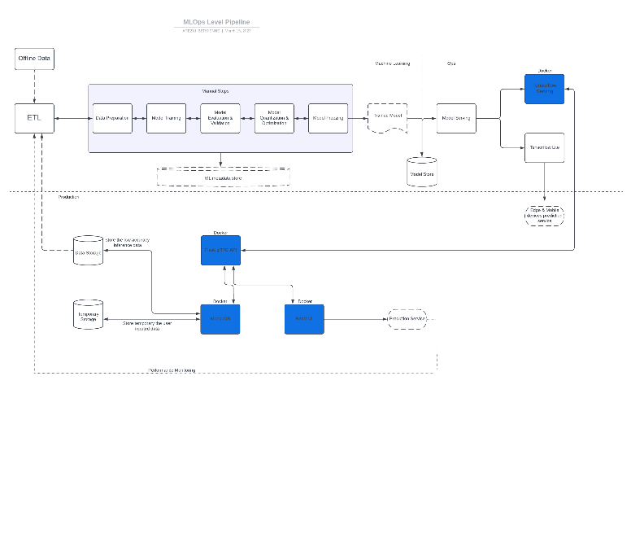

Design and Implementation of an Efficient and

Scalable MLOps Pipeline for Image Classification

\*Note: Sub-titles are not captured in Xplore and should not be used

*Abstract*—This paper presents a design and implementation of a scalable
and efficient machine learning pipeline for image classification tasks.
The pipeline includes several components, such as data preprocessing,
model training, model evaluation, model optimization, and serving. The
design incorporates containerization using Docker for efficient
deployment and scalability. TensorFlow is used as the machine learning
framework for model development and serving, while Flask is used for
building a gRPC API for client communication. MongoDB is used for data
storage and retrieval, and React is used to build a user interface for
interaction with the system. The hardware configuration for an
enterprise-level deployment includes a cluster of machines with multiple
dedicated GPUs and high-end processors to handle the large scale of data
and model training requirements. For smaller businesses, a
cost-effective configuration is also presented that utilizes a single
machine with a dedicated GPU. The design also includes an infrastructure
test plan for rolling back and replacing trained models to ensure
reliability and maintainability of the system. The use of pruning
techniques for model optimization and the implementation of a model
freezing strategy is presented for efficient serving and deployment.
Overall, the proposed design and implementation of the machine learning
pipeline provides a scalable and efficient solution for image
classification tasks that can be tailored to the needs and resources of
both small and large businesses.

Keywords—Machine Learning, Deep Learning, Containerization, enterprise
infrastructure.

# Introduction 

Machine Learning (ML) is a rapidly growing field that has become a
popular approach for solving complex real-world problems. As
organizations continue to invest in ML to automate tasks, provide
insights and make data-driven decisions, the need to deploy and manage
ML models at scale has become increasingly important. Historically, data
scientists have developed ML solutions in isolation with little
consideration on how they will be deployed to a wider audience at scale.
However, as ML has matured over the last five years, there has been a
shift to apply a DevOps approach to ML pipelines, which is now referred
to as MLOps.

MLOps is an emerging practice that is a combination of DevOps, DataOps,
and ML/DL. MLOps is a set of principles, practices, and tools that
enable the creation and deployment of ML models with a focus on
automation, reproducibility, and scalability. MLOps aims to bridge the
gap between the data science team that creates models and the operations
team that deploys and manages them. This last is critical to the success
of ML projects. It enables organizations to deploy and manage ML models
at scale while ensuring that they are consistent, accurate, and
reliable. MLOps is not a single tool or framework; it is a combination
of tools, processes, and people. It includes various components, such as
the ML/DL libraries used to train the model, and Docker and Kubernetes
to provide an end-to-end production pipeline and lifecycle. MLOps also
includes toolchains for model and data exploration, monitoring and
alerting, feature stores, and more. The benefits of MLOps are numerous.
It helps to streamline the ML development process, making it more
efficient and productive. It enables organizations to deploy models
faster, more consistently, and with greater accuracy. Machine learning
operations also helps to reduce the risk of model failure and improves
the quality of the models by ensuring that they are tested, monitored,
and updated regularly. However, it is not without its challenges. One of
the major challenges of MLOps is the lack of standardization. The ML
ecosystem is complex and constantly evolving, and there are numerous
frameworks and tools available. This can make it difficult for
organizations to choose the right tools and ensure that they are
integrated correctly. Additionally, MLOps requires a significant
investment in infrastructure, tools, and personnel, which can be costly.
Despite the challenges, MLOps is rapidly gaining traction in the
industry, and there are numerous frameworks and tools available to
support it. Some of the popular open-source MLOps frameworks include
Kubeflow, MLflow, and TensorFlow Extended (TFX). Commercial offerings
include Google Cloud AI Platform, AWS SageMaker, and Microsoft Azure
Machine Learning.

Production is a critical component of MLOps. End-to-end pipelines enable
organizations to take models from development to production quickly and
efficiently. The traditional manual ML cycle is error-prone,
time-consuming, and not scalable. Automatic pipelines, on the other
hand, are more efficient, consistent, and scalable. MLOps enables
organizations to move away from the manual ML cycle and adopt automatic
pipelines.

Feature stores are another important component of MLOps. Feature stores
provide a centralized repository for feature engineering, allowing data
scientists to easily access and reuse features across multiple models.
Feature stores also improve the reproducibility of models by ensuring
that features are consistent and can be traced back to their original
source.

The goal of this paper is to provide a comprehensive overview of the
MLOps approach for enterprise machine learning deployment and management
by proposing a level 1 MLOps pipeline. To achieve this goal, this paper
is structured as follows. In the next section, I provide a background on
MLOps, including its benefits, challenges, and critical underpinning
technologies. Then, I discuss several important aspects that need to be
taken into account while implementing MLOps in considerations. In the
Design section of this paper I focus on the implementation of an
Enterprise Machine Learning System, specifically an object detection
system using a pre-existing TensorFlow 2 Object detection model from the
model zoo. The design will incorporate MLOps principles to ensure
scalability, maintainability, and reproducibility of the system.
Finally, in the last section, I will summarize my findings and provide
concluding remarks.

# Background

MLOps, short for Machine Learning Operations, refers to the set of
practices, tools, and technologies used to streamline and automate the
process of building, deploying, monitoring, and managing machine
learning models at scale. The goal of MLOps is to bridge the gap between
the development and deployment of machine learning models, enabling
organizations to deliver value from their AI initiatives more quickly
and reliably. The benefits of MLOps are numerous. By automating the
process of building, deploying, and monitoring machine learning models,
organizations can reduce the time and effort required to develop and
maintain their AI systems. This, in turn, enables them to deliver value
more quickly and cost-effectively, while also improving the accuracy,
reliability, and scalability of their models. As stated by Kai-Fu Lee,
the former President of Google China and founder of Sinovation Ventures:

"MLOps is critical to the success of AI initiatives because it allows
organizations to scale their AI efforts and deliver value to their
customers more quickly and efficiently. By adopting MLOps practices and
tools, organizations can streamline the entire ML development process,
from data preparation to model deployment, and ensure that their models
are accurate, reliable, and scalable."

One of the primary benefits of MLOps is the ability to deploy machine
learning models quickly and efficiently. With MLOps practices,
organizations can automate the deployment process and ensure that models
are deployed consistently across different environments. This reduces
the time and effort required for deployment, which is critical for
organizations that need to deploy models quickly to keep up with the
competition.

However, implementing MLOps is not without its challenges. One of the
most significant challenges is the complexity of the ML development
process itself. Machine learning models are highly complex, and
building, testing, and deploying them can require a significant amount
of time, effort, and resources. Furthermore, there is a shortage of
skilled data scientists and ML engineers who can effectively design,
build, and manage ML systems. As stated by Eric Siegel\[1\]

"Implementing MLOps requires a combination of technical expertise,
domain knowledge, and business acumen. Companies must have the right
people, processes, and technologies in place to ensure that their ML
initiatives are successful."

To address these challenges, organizations need to leverage the right
tools and technologies. ML/DL frameworks such as TensorFlow, PyTorch,
and Keras provide a high-level API for building and training machine
learning models. Containerization technologies such as Docker and
Kubernetes provide a standardized way to package and deploy ML models,
making it easier to move models between different environments. As
stated by Alex Giamas, the Head of Engineering at N26:

"Containerization technologies like Docker and Kubernetes are essential
for MLOps because they provide a standardized way to package and deploy
machine learning models. This enables organizations to move their models
between different environments, from development to production, with
minimal effort."

According to a report by Gartner \[2\], "by 2023, more than 50% of
enterprise machine learning model deployments will be automated, up from
less than 5% in 2019." This highlights the growing importance of MLOps
practices in today's world, and the need for organizations to adopt
these practices to stay competitive.

The first stage in the MLOps workflow is the design phase, where the ML
team defines the problem statement, acquires and preprocesses data, and
develops a model. The main goal of this phase is to develop a model that
can solve the given problem as accurately and efficiently as possible.
Once the model is developed, it must be deployed to a production
environment where it can be accessed by end-users. This leads to the
next stage of the MLOps workflow, model deployment. During this stage,
the model is integrated into the target production environment and made
available to end-users. According to Kelleher and Tierney \[3\],("model
deployment is a critical aspect of MLOps, as it ensures that the model
is serving its intended purpose in a live environment."

The final stage of the MLOps workflow is operations, where the deployed
model is monitored and maintained. This stage includes monitoring the
model's performance, troubleshooting issues that arise, and making
updates to the model when necessary. In addition to the three stages of
the MLOps workflow, toolchains and exploration techniques are also
essential components of the workflow. Toolchains, which are sets of
tools used to automate the various stages of the MLOps workflow, can
help increase efficiency and reduce human error. According

Finally, both data and model exploration techniques play a critical role
in the MLOps workflow. Data exploration techniques, such as data
visualization and feature engineering, help the ML team better
understand the data they are working with, while model exploration
techniques, such as sensitivity analysis and error analysis, can help
identify areas where the model can be improved. In the flow of
facilitating the ML deployment, several MLOps frameworks were born. Over
years they have gained significant attention, both in industry and
academia, due to their ability to streamline the development,
deployment, and maintenance of machine learning models. There are
several commercial and open-source MLOps frameworks available that offer
different features and capabilities. I will compare three of the most
widely used commercial MLOps frameworks: Google Cloud AI Platform,
Amazon SageMaker, and Microsoft Azure Machine Learning. First, let's
compare the pricing models of these three frameworks. Google Cloud AI
Platform offers a pay-as-you-go model, where users are charged for the
time and resources they use. Amazon SageMaker has a similar pricing
model but also offers savings plans and reserved instances for long-term
use. Microsoft Azure Machine Learning, on the other hand, has a more
complex pricing model based on various factors such as the number of
nodes and the type of compute used. In terms of deployment options, all
three frameworks offer support for deploying models on the cloud,
on-premise, or in hybrid environments. However, Google Cloud AI Platform
and Microsoft Azure Machine Learning offer more flexibility in terms of
the programming languages and frameworks that can be used for
deployment, while Amazon SageMaker is limited to specific frameworks
such as TensorFlow and PyTorch. Next, let's consider the tools and
features offered by these frameworks for model development and training.
Google Cloud AI Platform offers a wide range of tools, including AutoML
for automated model training, Cloud Dataflow for data preprocessing, and
Cloud ML Engine for distributed training. Amazon SageMaker offers
similar tools such as Automatic Model Tuning and Ground Truth for data
labeling. Microsoft Azure Machine Learning offers a similar set of
tools, including Auto ML and data labeling services. In terms of data
management and exploration, all three frameworks provide features for
data versioning, monitoring, and visualization. However, Google Cloud AI
Platform and Microsoft Azure Machine Learning offer more advanced
features such as data labeling and data drift detection. Finally, let's
consider the level of support and documentation offered by these
frameworks. Google Cloud AI Platform, Amazon SageMaker, and Microsoft
Azure Machine Learning all provide comprehensive documentation and
customer support options. However, Google Cloud AI Platform and Amazon
SageMaker offer more extensive support and training resources, including
online courses and certification programs.

There are also several open-source MLOps frameworks available in the
market. Three of the most widely used open-source MLOps frameworks are :
TensorFlow Extended (TFX), Kubeflow, and MLflow.

TFX is an end-to-end platform for building and deploying production ML
pipelines. It is an open-source framework built on top of TensorFlow
that enables developers to build scalable and reproducible ML pipelines.
TFX provides several components such as data validation, preprocessing,
feature engineering, and model training, among others. It also supports
several deployment options, including serving models on-premises or in
the cloud. TFX has gained popularity due to its ease of use,
scalability, and integration with other Google Cloud services. As a
quote from the TensorFlow team states, "TFX provides a foundation for
building ML systems that can handle production-level datasets and
workflows."

Kubeflow is another open-source MLOps framework that provides a platform
for deploying ML workflows on Kubernetes. Kubeflow provides several
components such as Jupyter notebooks, model training, hyperparameter
tuning, and serving models. It also supports several deployment options,
including on-premises, hybrid, and multi-cloud environments. Kubeflow's
strength lies in its ability to leverage Kubernetes' capabilities, such
as scalability, fault tolerance, and resource allocation. As a quote
from the Kubeflow website states, "Kubeflow's goal is to make deploying
and managing ML workflows on Kubernetes simple, portable, and scalable."

MLflow is an open-source MLOps framework that provides a platform for
managing the end-to-end machine learning lifecycle. It supports several
tasks such as model training, experimentation tracking, model packaging,
and deployment. MLflow is designed to be platform-agnostic and supports
multiple ML frameworks such as TensorFlow, PyTorch, and Scikit-learn. It
also provides several deployment options, including on-premises, cloud,
and edge environments. MLflow has gained popularity due to its
flexibility, ease of use, and compatibility with other open-source ML
frameworks. As a quote from the MLflow website states, "MLflow's mission
is to provide a complete ML lifecycle platform that works with any ML
library and any deployment tool.".

Those frameworks provide a fully-automated end-to-end pipeline. One of
the main goals of MLOps is to automate the entire ML lifecycle, from
data preparation and model training to deployment and monitoring. MLOps
pipelines can be classified into three different levels of automation:
manual, semi-automated, and fully automated. The manual level involves
the use of traditional software development practices, such as manual
code reviews and ad-hoc testing. This level of automation is
time-consuming and error-prone, making it challenging to maintain large
and complex ML systems.

The semi-automated level involves the use of tools that automate some
parts of the ML workflow, such as data preprocessing, model training,
and deployment. However, human intervention is still required at various
stages of the pipeline, such as feature engineering and hyperparameter
tuning. This level of automation strikes a balance between manual and
fully automated pipelines, allowing for more significant flexibility and
control over the ML workflow.

The fully automated level involves the use of end-to-end MLOps platforms
such as mentioned before, that automate the entire ML workflow, from
data ingestion and preparation to model deployment and monitoring. These
platforms utilize advanced technologies such as containerization,
microservices, and orchestration frameworks to provide a seamless and
integrated ML pipeline.

A study by IBM highlights the importance of pipeline automation in
MLOps, stating that "Automation of the pipeline is critical to enable
the scaling of ML initiatives and to ensure consistency and quality of
the output." \[4\]

In comparison to manual ML cycles, automated pipelines provide several
benefits, such as increased efficiency, reduced time to market, and
improved model performance. A report by Gartner notes that "Enterprises
that adopt MLOps to automate the ML pipeline will reduce the time
required to deploy models from weeks to hours or even minutes." \[2\]

Overall, the level of automation in MLOps pipelines should be determined
by the complexity and size of the ML system. For small and simple ML
systems, manual or semi-automated pipelines may be sufficient. However,
for larger and more complex ML systems, fully automated pipelines are
necessary to ensure efficiency and scalability.

Another aspect of the MLOps pipeline are the features stores. Feature
stores have emerged as a crucial component in the MLOps pipeline, with
the potential to improve efficiency, scalability, and reproducibility of
machine learning workflows. A feature store is essentially a centralized
and scalable repository for features used in machine learning models,
with the ability to efficiently manage feature extraction, storage,
retrieval, and sharing across different applications and teams. In this
section, we will explore the role of feature stores in the ML pipeline,
their benefits, and how they compare to traditional approaches.

One of the primary benefits of feature stores is their ability to
improve the efficiency and speed of the ML pipeline. By providing a
centralized and efficient way to store and manage features, feature
stores enable faster and more reliable model training and iteration.
Feature stores also promote better collaboration and reproducibility
across teams and projects. With a shared and standardized feature
repository, different teams can leverage the same features for their
models, reducing duplication of efforts and improving consistency.
Furthermore, feature stores provide a way to version and track changes
in features, enabling better reproducibility and auditability of the
machine learning pipeline.

In addition to these benefits, feature stores also provide advanced
capabilities such as feature engineering, feature serving, and feature
validation. Feature engineering is the process of transforming raw data
into features that can be used by machine learning models. With a
feature store, feature engineering can be standardized, automated, and
shared across teams, leading to more consistent and efficient feature
engineering practices. Feature serving is the process of providing the
features to the machine learning models during inference. Feature stores
can improve the efficiency and scalability of feature serving by caching
and precomputing features. Feature validation is the process of ensuring
that the features are correct and of high quality. Feature stores can
provide tools for feature validation, such as statistical analysis and
outlier detection.

Despite the benefits of feature stores, there are also challenges and
considerations to take into account. One of the challenges is the
complexity of managing and maintaining a feature store, which requires
expertise in data management, machine learning, and software
engineering. Furthermore, feature stores must be designed with
scalability, security, and governance in mind, to ensure that they can
handle large volumes of data, prevent data breaches, and comply with
regulatory requirements. Another consideration is the compatibility of
feature stores with different ML frameworks and tools. While some
feature stores, such as Feast and Tecton, support multiple ML
frameworks, others are designed to work with specific frameworks, such
as Hopsworks for TensorFlow and PyTorch, and Featurestore.ai for Hugging
Face Transformers. Therefore, it is important to select a feature store
that aligns with the ML framework and tools being used in the
organization.

In conclusion, MLOps is a critical component of any successful AI
initiative. By streamlining and automating the process of building,
deploying, and managing machine learning models, organizations can
deliver value more quickly and cost-effectively while also improving the
accuracy, reliability, and scalability of their models. However,
implementing MLOps is not without its challenges, and organizations need
to leverage the right tools and technologies to ensure their ML
initiatives are successful.

# Considerations

> In the implementation of MLOps, there are several considerations that
> must be taken into account. One of the primary considerations is the
> need for a cross-functional team that brings together data scientists,
> engineers, and IT professionals to collaborate and work towards a
> common goal. As Sagi Rubin, the Vice President of Products at HPE
> Ezmeral, notes, "There's no one-size-fits-all when it comes to MLOps.
> But there is one thing that's true for everyone – you need a
> cross-functional team with data scientists, developers, and IT pros
> working together to get the job done."

Another consideration is the importance of data governance and security.
With the increasing amount of data being used in ML models, it is
critical to have strict controls and policies in place to ensure that
the data is used ethically and securely. According to a report by
Deloitte\[5\], "The same focus on security and governance that applies
to traditional IT systems must be applied to AI models and the data that
feeds them. This includes access controls, encryption, monitoring, and
audit trails."

In addition, it is essential to have a clear understanding of the
business objectives and requirements of the ML project. The ML model
must be designed and trained in a way that aligns with these objectives
and provides value to the organization. As Sameer Farooqui, the Director
of AI and Machine Learning at Google Cloud, states\[6\], "It's critical
to have a clear understanding of the business objectives and
requirements upfront, and to track them throughout the development
process, so that the models that are built are both useful and used."

Furthermore, it is important to consider the scalability and
maintainability of the ML system. As the ML models become more complex
and the volume of data increases, it is necessary to ensure that the
system can handle the load and can be easily maintained over time. As
Gartner notes in their report on MLOps\[2\], "Scaling machine learning
operations requires that organizations apply DevOps principles to their
models, data and infrastructure."

Another important consideration for MLOps is the management of data. As
stated by a group of researchers, "Data management plays a critical role
in MLOps."\[7\]. In order to effectively implement MLOps, it is
essential to have a solid data management strategy in place. This
includes proper data labeling, versioning, and storage. It is also
important to ensure the privacy and security of the data throughout the
MLOps workflow.

Another key consideration for MLOps is the integration of DevOps
principles. As MLOps is an extension of DevOps, it is important to align
the two practices to effectively manage the entire ML lifecycle. This
involves the integration of tools and processes used for version
control, continuous integration, and continuous deployment. As stated by
a group of researchers, "DevOps practices such as continuous
integration, continuous delivery, and continuous deployment can be
applied to MLOps pipelines to achieve better automation, collaboration,
and faster delivery of models to production." \[8\]

Lastly, the ethical considerations of MLOps cannot be overlooked. As ML
models have the potential to impact individuals and society as a whole,
it is essential to consider the ethical implications of the models being
deployed. This includes issues such as bias and fairness in the data and
models, privacy concerns, and the potential for unintended consequences.
As stated by a group of researchers, "It is important to ensure that ML
models are developed and deployed ethically and with the understanding
that they can have wide-ranging impacts."\[7\].

In summary, effective MLOps requires consideration of several key
factors, including tool selection, data management, integration of
DevOps principles, and ethical considerations. By addressing these
factors, organizations can successfully manage the entire ML lifecycle
and ensure that their ML models are developed and deployed in a
responsible and effective manner.

# Methodology

In designing a machine learning system, one of the key components is the
data processing and preparation stage, commonly referred to as the
Extract-Transform-Load (ETL) process. This process is critical in
ensuring that the data is correctly prepared and optimized for use in
the model training process. In this section, we will explore the ETL and
manual steps process in detail, including each step and the tools and
technologies involved. Figure 1 Shows every steps explained in the
methodology.

1.  Figure 1 MLOps Level 1 Pipeline

## Pipeline Design

### Data Ingestion 

The first step in the ETL process is data ingestion. This involves the
collection of data from various sources, including structured and
unstructured data, and loading it into a suitable storage location. For
our bird species classification system, we will be dealing with image
and video data. Therefore, we will need to collect the data from various
sources and store it in a central location. To accomplish this, I will
manually collect the data but also use the use the images with low
predictions score that we get back through the pipeline.

### Data Cleaning

Once we have the data in a central storage location, the next step is to
clean and prepare the data for model training. This process involves
removing any noise or irrelevant data, such as duplicates or irrelevant
metadata, that may negatively impact the model's accuracy. Data cleaning
is a critical step in ensuring that the model is trained on quality data
that is representative of the real-world use case. For our bird species
classification system, we will use a combination of TensorFlow's data
preprocessing functions and custom scripts to perform the data cleaning
process.

### Data Transformation

After the data cleaning process, the next step is data transformation.
This step involves transforming the data into a format suitable for
model training. In our case, this involves converting the image and
video data into a format that can be used by TensorFlow's Object
Detection API. This transformation includes resizing the images and
videos, converting the data to the appropriate file format, and applying
any necessary data augmentation techniques. We will use TensorFlow's
Object Detection API and custom scripts to perform the data
transformation process.

### Model Training

With the data now preprocessed and transformed, the next step is model
training. This step involves training the machine learning model using
the preprocessed data to generate an accurate and robust model capable
of accurate bird species classification. In our case, we will use a
pre-existing TensorFlow 2 Object Detection model from the TensorFlow
Model Zoo. To fine-tune the model for our specific use case, we will use
transfer learning, a technique that involves reusing an existing
pre-trained model and adapting it for a new use case.

### Model Evaluation and Validation

This step is crucial to ensure that the trained model performs
accurately on the test data and generalizes well to new data.

There are various techniques for model evaluation and validation,
including hold-out validation, k-fold cross-validation, and stratified
sampling. In our pipeline, we will use k-fold cross-validation, as it
provides a more accurate estimate of the model's performance by testing
it on different subsets of the data.

In k-fold cross-validation, the data is split into k equal parts, or
folds. The model is trained on k-1 folds and tested on the remaining
fold. This process is repeated k times, with each fold serving as the
testing set once. The results of the k tests are then averaged to
provide an overall performance metric.

### Model Optimization and Quantitation 

Model quantization and optimization are critical steps in the process of
deploying machine learning models for inference. These steps aim to
reduce the model size, decrease the inference time, and make the model
more efficient for deployment on resource-constrained devices such as
mobile phones, IoT devices, and edge devices. In this project, we will
use the TensorFlow framework, which offers various quantization and
optimization techniques.

One of the techniques that we can use is weight quantization. Weight
quantization reduces the model size by quantizing the weights of the
model to a smaller number of bits. This technique is widely used and can
significantly reduce the model size. We can use post-training
quantization, which involves quantizing the weights of the model after
it has been trained. This technique is straightforward to implement, and
the accuracy of the model is usually preserved.

Another technique that we can use is dynamic range quantization. Dynamic
range quantization is a form of post-training quantization that involves
quantizing the weights of the model to a smaller number of bits based on
the range of the weights. This technique can further reduce the model
size and improve the model's efficiency.

For our specific case we will use pruning as a technique to optimize our
model. Pruning involves removing unnecessary weights from the model,
which can significantly reduce the model size and inference time.
Pruning can be done during training or after training. We can use
structured pruning, which involves pruning entire filters or channels of
a layer, or unstructured pruning, which involves pruning individual
weights. In the case of our object detection system, pruning can be a
particularly effective technique to reduce the size of the model and
improve its efficiency, especially if we plan to deploy the model on
mobile or edge devices with limited resources. Pruning can also help
reduce the cost of hosting the model in the cloud, as smaller models
require less computational power and storage.

There are several benefits to using pruning over other optimization
techniques. First, pruning can be applied after the model has been
trained, so it does not require any changes to the training process or
the training data. This can save a significant amount of time and
resources compared to other techniques, such as quantization or
distillation, which require retraining the model from scratch.

Second, pruning can be customized to fit the specific needs of our
object detection system. We can choose which layers or neurons to prune,
and we can set different pruning rates for different parts of the
network depending on their importance or complexity. This allows us to
balance the trade-off between model size and accuracy, and to optimize
the model for our specific use case.

### Model Freezing

In our case, since we are using TensorFlow Serving for model deployment
and inference, we will need to convert our trained and optimized model
to a format that can be used by TensorFlow Serving. One such format is
the SavedModel format, which is TensorFlow's recommended format for
saving models. This format allows for easy deployment of models on
different platforms, such as serving models using TensorFlow Serving or
running them on mobile or edge devices using TensorFlow Lite.

Once we have our optimized and pruned model in the SavedModel format, we
can easily deploy it on a TensorFlow Serving instance. TensorFlow
Serving allows us to serve our model over a network, and can handle
multiple versions of our model, making it easy to update and replace
models as needed. We can also use TensorFlow Serving to load and serve
multiple models at once, allowing us to easily switch between models
depending on our use case.

For running our model on mobile or edge devices, we can use TensorFlow
Lite. TensorFlow Lite is a lightweight version of TensorFlow designed
for mobile and edge devices, and supports a variety of hardware
platforms. TensorFlow Lite also provides tools for converting TensorFlow
models to a format that can be used on mobile or edge devices, making it
easy to deploy our models to these platforms.

In summary, we will convert our trained and optimized model to the
SavedModel format, which can be used by TensorFlow Serving for model
deployment and inference. We can also use TensorFlow Lite for running
our model on mobile or edge devices, with tools provided for converting
TensorFlow models to a format that can be used on these platforms.

### TensorFlow Serving

we will need to use the official TensorFlow Serving Docker image, which
is designed to run TensorFlow models as a REST API or gRPC service. This
image contains a minimal TensorFlow Serving installation with a reduced
footprint and a pre-built binary of TensorFlow Serving.

We will link this container to the container running the web application
using Docker networking. Docker networking allows containers to
communicate with each other in a secure and isolated manner. We will
create a user-defined bridge network in Docker and add both containers
to the network. The bridge network will enable the containers to
communicate with each other using their container names as the
hostnames.

### TensorFlow LITE

To enable TF Lite to work with the object detection model, we need to
convert the frozen graph obtained after optimization and quantization to
the TF Lite format. This process involves using the TensorFlow Lite
converter, which takes the frozen graph and converts it into a
flatbuffer format that can be easily used by mobile and edge devices.

Once the model is converted to the TF Lite format, it can be deployed to
the edge device. The edge device can then use the TF Lite interpreter to
load the model and perform object detection on input images or videos.
This process is highly optimized for mobile and edge devices, making it
ideal for real-time object detection applications.

In terms of linking, the TF Lite model can be stored on the edge device
itself, or it can be loaded dynamically from a remote server using a
REST API or gRPC interface. In our case is store on the edge device.

### Flask gRPC API

The Flask gRPC API is a critical component of the proposed system
architecture. It is responsible for handling user requests for image and
video data, passing them to the prediction and returning the results of
the model. The API is built on top of the Flask framework and uses the
gRPC protocol for efficient communication between the client and the
server.

To create the Flask gRPC API, we will need to build a Docker image
containing all the necessary dependencies, including the Flask
framework, gRPC libraries, and other supporting libraries. The Docker
image will be built using a Dockerfile that specifies the base image,
environment variables, and required packages.

The Flask gRPC API is linked to several other components in the proposed
architecture. First, it is linked to the TF Serving ,but also to the
mongoDB container and the UI app.

The Flask gRPC API is an essential component of the system as it
provides a simple and efficient way for users to interact with the
object detection model. By using Flask, we can easily handle requests
from multiple users concurrently while also providing a straightforward
RESTful API. The use of gRPC further enhances performance and efficiency
by allowing for fast and lightweight communication between the client
and the server.

In summary, the Flask gRPC API is a crucial component of the proposed
system architecture. Its role is to handle user requests, preprocess the
data, and communicate with the TensorFlow Serving instance for
prediction. The creation of the Docker image for the API is
straightforward, and the image is linked to several other components of
the system, including pre-processing and TensorFlow Serving.

### MongoDB

The mongoDB container in the diagram serves as a data base liaison
component for the project. Connected to two volumes when being a
temporary storage and the data storage. MongoDB container is also linked
to the Flask gRPC API container, which allows the API to access the
database and retrieve the necessary data.

The feature to save temporary images when the prediction accuracy is
below a certain threshold is an important aspect of the object detection
system. When a prediction is made and the accuracy is below the
threshold, the Flask application will send a request to the MongoDB
container to store the temporary image. The request will include
relevant metadata such as the image name, the object detected, and the
confidence score. The MongoDB container will store this information in a
collection that can be accessed later for training purposes (data
storage).

We will establish a link between the Flask application and the MongoDB
container using Docker networking. We will create a Docker network that
will allow the Flask application and the MongoDB container to
communicate with each other. The Flask application will use the IP
address of the MongoDB container to send requests to it, and the MongoDB
container will respond with the appropriate information.

To create the MongoDB container, we will use the official MongoDB image
available on Docker Hub. We will create a Dockerfile that specifies the
necessary configuration for the container, such as the port to use and
the location to store the data. The Dockerfile will also include any
additional libraries or dependencies required for the container to
function properly.

In summary, the link between the Flask application and the MongoDB
container is essential for the object detection system to function
effectively. By storing the temporary images in a database, we can use
them for training purposes and improve the accuracy of the model over
time. Using Docker networking and a Dockerfile, we can create the
necessary containers and establish the required links to ensure that the
system operates smoothly.

### React UI

The React UI container in the diagram plays a crucial role in the
overall system architecture. Its primary purpose is to provide a
user-friendly interface that allows users to interact with the system
and view the results of the model predictions. The React UI container
serves as the front-end of the system and is responsible for
communicating with the Flask API container and retrieving the prediction
results.

To create the React UI container image, we would use a Dockerfile that
specifies the necessary dependencies and libraries needed to build the
image. The Dockerfile would contain instructions to download and install
Node.js and the necessary packages to run a React application.
Additionally, the Dockerfile would specify the files required to run the
React application, including the source code and any other assets such
as images, CSS stylesheets, and HTML templates.

The React UI container interacts with the Flask API container through
RESTful API calls. When a user submits an image or video for prediction,
the React UI container sends a request to the Flask API container, which
in turn forwards the request to the TensorFlow Serving container. The
TensorFlow Serving container then processes the request and sends back
the prediction results to the Flask API container, which forwards the
results to the React UI container for display.

One of the significant benefits of using a React UI container is its
ability to provide real-time monitoring and visualization of the
system's performance. The React UI container can display metrics such as
prediction accuracy, latency, and throughput in real-time, allowing
system administrators to monitor the system's health and identify any
issues quickly. Additionally, the React UI container can provide a
dashboard that displays system usage statistics, such as the number of
requests processed, the number of successful predictions, and the number
of failed predictions.

Overall, the React UI container plays a critical role in the system
architecture, providing users with a user-friendly interface to interact
with the system and administrators with a tool for monitoring the
system's performance. Its use of React and RESTful API calls makes it
highly scalable and flexible, making it an ideal choice for building
modern web applications.

In conclusion, the presented diagram shows the entire architecture of a
small-scale image classification system, which includes a variety of
technologies, tools and frameworks. The use of a microservices
architecture, implemented through containerization technology, enables
easy scalability, flexibility and modularity of the system. Each
container is designed to perform a specific task or set of tasks, which
allows for easy debugging, monitoring and updating of individual
components.

The use of Flask, Rest API, and gRPC enables easy communication between
the user interface, the image classifier and the data storage, allowing
for seamless user experience. The use of TF serving and TF Lite for
model deployment ensures high performance and scalability of the system.
Additionally, the use of MongoDB as the data storage ensures efficient
and reliable data management.

The decision to use pruning for model optimization was made due to the
ability to reduce model size while maintaining high accuracy. Freezing
the model and using the TensorFlow Lite format allows for easy
deployment on mobile devices, while the use of TensorFlow serving
enables model deployment on the server-side.

The use of React UI container enables easy integration of the user
interface with the rest of the system. The use of Mena for monitoring
provides valuable insights into the performance of the system, which can
be used to optimize and improve the system.

Although the use of four different containers for a small-scale project
may seem excessive, it provides a high level of flexibility, modularity,
and scalability, making the system more robust and easier to maintain.
Moreover, the choice of each technology and framework was based on its
unique features, strengths and benefits, which contributes to the
overall efficiency and effectiveness of the system.

Overall, the presented architecture provides a robust and scalable
solution for small-scale image classification systems, which can be
easily extended to handle larger datasets and higher traffic. The system
is designed to provide an intuitive and seamless user experience while
maintaining high accuracy and performance.

At an enterprise level, the hardware requirements for this design would
need to be more robust in order to handle larger workloads and ensure
high availability. The following are the recommended hardware
specifications for each component of the system:

1.  Data storage server:

The data storage server should have a minimum of 64 GB RAM and a
high-performance solid-state drive (SSD) with a capacity of at least
1TB. A dual-core or quad-core processor with a clock speed of 2.0 GHz or
higher is also recommended to handle multiple requests.

2.  TF Serving container:

The TF Serving container should have a minimum of 16 GB RAM and a
quad-core processor with a clock speed of 2.5 GHz or higher. An Nvidia
dedicated GPU would be an ideal choice in our system design. GPUs are
designed to accelerate the processing of large amounts of data, which
makes them a perfect fit for deep learning workloads. The use of a
dedicated GPU allows for faster and more efficient inference, which is
essential for real-time applications such as image and video
recognition.

When it comes to Nvidia GPUs, they are known for their high performance
and reliability, making them a popular choice in the deep learning
community. Nvidia's GPUs are designed with deep learning workloads in
mind, and they come with a range of specialized features such as Tensor
Cores, which are specifically designed for deep learning operations.

In addition to the performance benefits, using a dedicated GPU for TF
Serving also allows for better scalability. As the number of users and
requests to the system increases, a dedicated GPU can handle the
increased load more efficiently than a CPU-only setup, which can lead to
better performance and faster response times.

Therefore, a dedicated Nvidia GPU, such as the Nvidia Tesla V100, would
be an excellent choice for our TF Serving component. The Tesla V100 is
specifically designed for deep learning workloads and comes with 5,120
CUDA cores and 640 Tensor Cores, providing high performance and
efficient inference. Additionally, the Tesla V100 has a large memory
capacity, which is essential for handling large models and datasets.

In conclusion, using an Nvidia dedicated GPU, such as the Tesla V100,
for our TF Serving component would provide the performance, reliability,
and scalability needed for our system design.

3.  Flask gRPC API container:

The Flask gRPC API container should have a minimum of 8 GB RAM and a
dual-core processor with a clock speed of 2.0 GHz or higher.

4.  MongoDB container:

The MongoDB container should have a minimum of 16 GB RAM and a
high-performance SSD with a capacity of at least 500 GB. A quad-core
processor with a clock speed of 2.5 GHz or higher is also recommended.

5.  React UI container:

The React UI container should have a minimum of 8 GB RAM and a dual-core
processor with a clock speed of 2.0 GHz or higher.

In addition to the hardware requirements for each component, the system
should also have a load balancer to distribute incoming requests across
multiple instances of the Flask gRPC API container for high
availability. A dedicated firewall should also be set up to protect the
system from external threats.

The justification for these hardware choices is that they provide a
balance between performance and cost-effectiveness. The high amount of
RAM and fast processors will allow for efficient handling of large
amounts of data and requests, while the use of SSDs will ensure fast
read and write speeds. The dedicated GPU in the TF Serving container
will allow for faster processing of requests, and the load balancer will
ensure that the system can handle high traffic loads without downtime.
The use of a firewall will also help to protect the system from external
threats.

For small businesses or startups that may not have the budget for
enterprise-level hardware, there are still options to implement this
design with cost-effective hardware.

One option is to use cloud-based services such as Amazon Web Services
(AWS), Microsoft Azure, or Google Cloud Platform (GCP). This eliminates
the need for purchasing physical hardware and also provides scalability
options as the business grows.

Another option is to use consumer-grade hardware such as a standard
desktop computer with a powerful processor and a dedicated GPU. This can
be a more affordable solution compared to enterprise-level hardware.
However, it may have limitations in terms of scalability and
performance.

For the TF serving component, a Nvidia Jetson Nano can be used as a
cost-effective option. It is a small, low-power, and affordable
single-board computer that has a dedicated GPU and is optimized for
running deep learning workloads. While it may not have the same level of
performance as a dedicated server with a high-end GPU, it can still
provide efficient and reliable inference for small to medium-sized
models

## Infrastructure Test Plan

An infrastructure test plan is an essential component of any design that
involves complex software and hardware systems. In our design, which
involves multiple Docker containers, REST API, gRPC, TF serving, and TF
Lite, it is important to ensure that the infrastructure is tested to
ensure that it functions optimally.

One critical aspect of the infrastructure test plan is the ability to
roll back and replace trained models. This is essential to ensure that
the system can adapt to changes and updates without compromising on
performance or stability. The following are the steps involved in
rolling back and replacing trained models:

- Version control: The first step is to ensure that the trained models
  are version controlled. This means that each version of the model is
  tagged and stored in a central repository. This allows for easy
  tracking of changes and the ability to revert to an earlier version if
  necessary.

- Testing: Once a new version of the trained model is available, it is
  essential to test it before deploying it to the production
  environment. This involves running a battery of tests to ensure that
  the new model performs better than the existing one.

- Deployment: Once the new model has been tested and verified, it can be
  deployed to the production environment. However, it is important to
  ensure that the system can be rolled back to the previous version if
  necessary.

- Rollback: In case the new model does not perform as expected, it is
  important to have a rollback plan in place. This involves reverting to
  the previous version of the model, which should be version controlled
  and stored in a central repository.

- Monitoring: Once the new model has been deployed, it is essential to
  monitor the system closely to ensure that it is functioning optimally.
  This involves collecting data and analyzing it to identify any issues
  or areas that require improvement.

In conclusion, the ability to roll back and replace trained models is
critical to the success of any design that involves complex software and
hardware systems. By implementing a comprehensive infrastructure test
plan that includes version control, testing, deployment, rollback, and
monitoring, we can ensure that our system is robust, stable, and
adaptable to changes and updates.

# Conclusion

In conclusion, the proposed design is a robust and scalable solution for
deploying a machine learning model in a production environment. The
design uses a combination of technologies and components, including
TensorFlow, Flask, gRPC, MongoDB, React, and Docker, to create a
flexible and reliable architecture. The design allows for easy scaling
and updates, with the ability to replace and roll back trained models as
needed.

The hardware requirements for the proposed design are optimized for
performance and cost-effectiveness, depending on the size and needs of
the enterprise. The design can accommodate both high-end dedicated GPUs
for larger enterprises and cost-effective solutions for smaller
businesses.

Overall, the proposed design offers a powerful and flexible solution for
deploying machine learning models in a production environment. Its
combination of technologies and components provides a scalable and
reliable architecture, with the ability to update and roll back trained
models as needed. The infrastructure test plan ensures that the system
is thoroughly tested and validated before deployment.

##### References

\[1\] Eric Siegel, *Predictive Analytics: The Power to Predict Who Will
Click, Buy, Lie, or Die*. 2013.

\[2\] I. Gartner, “Gartner Says More Than Half of Enterprise IT Spending
in Key Market Segments Will Shift to the Cloud by 2025,” Feb. 09, 2022.

\[3\] John D Kelleher and Brendan Tierney, *Data Science*. 2021.

\[4\] IBM, “Overcome Obstacles To Get To AI At Scale,” 2020.

\[5\] Deloitte, “Deloitte”.

\[6\] Sameer Farooqui, “Google Summit.”

\[7\] Danshi Wang and Min Zhang, “Artificial Intelligence in Optical
Communications: From Machine Learning to Deep Learning,” 2021.

\[8\] S. Garg, P. Pundir, G. Rathee, P. K. Gupta, S. Garg, and S.
Ahlawat, “On Continuous Integration / Continuous Delivery for Automated
Deployment of Machine Learning Models using MLOps,” 2021.

 
